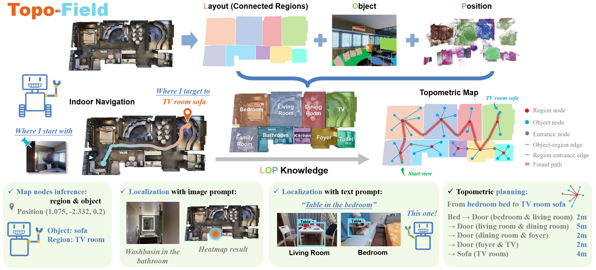

# Topo-Field: Topometric mapping with Brain-inspired Hierarchical Layout-Object-Position Fields

[[Website]](https://jarvishou829.github.io/Topo-Field/) [[Code]](https://github.com/fudan-birlab/Topo-Field) [[Supp]](./docs/supp.pdf)

Authors: [Jiawei Hou](https://jarvishou829.github.io), Wenhao Guan, Longfei Liang, Jianfeng Feng, Xiangyang Xue, Taiping Zeng.



**Tl;dr** Inspired by a population code in the postrhinal cortex (POR) strongly tuned to spatial layouts over scene content rapidly forming a high-level cognitive map, this work introduces Topo-Field, a framework that integrates Layout-Object-Position (LOP) associations into a neural field and constructs a topometric map from this learned representation.

## Installation
To properly install this repo and all the dependencies, follow these instructions.

```
# Clone this repo.
git clone --recursive https://jarvishou829.github.io/Topo-Field
cd Topo-Field

# Create conda environment and install the dependencies.
conda create -n tf python=3.8
conda activate tf
conda install -y pytorch torchvision torchaudio cudatoolkit=11.8 -c pytorch-lts -c nvidia
pip install -r requirements.txt

# Install the hashgrid encoder with the relevant cuda module.
cd gridencoder
# For this part, it may be necessary to find out what your nvcc path is and use that, 
# For me $which nvcc gives /user/local/cuda/11.8/bin/nvcc, so I used the following part
# export CUDA_HOME=/user/local/cuda/11.8
python setup.py install
cd ..
```

## Acknowledgements
We would like to thank the following projects for making their code and models available, which we relied upon heavily in this work.
* [CLIP](https://github.com/openai/CLIP) with [MIT License](https://github.com/openai/CLIP/blob/main/LICENSE)
* [Detic](https://github.com/facebookresearch/Detic/) with [Apache License 2.0](https://github.com/facebookresearch/Detic/blob/main/LICENSE)
* [Torch NGP](https://github.com/ashawkey/torch-ngp) with [MIT License](https://github.com/ashawkey/torch-ngp/blob/main/LICENSE)
* [LSeg](https://github.com/isl-org/lang-seg) with [MIT License](https://github.com/isl-org/lang-seg/blob/main/LICENSE)
* [Sentence BERT](https://www.sbert.net/) with [Apache License 2.0](https://github.com/UKPLab/sentence-transformers/blob/master/LICENSE)
* [CLIP-Field](https://github.com/notmahi/clip-fields) with [MIT License](https://github.com/notmahi/clip-fields/blob/main/LICENSE)